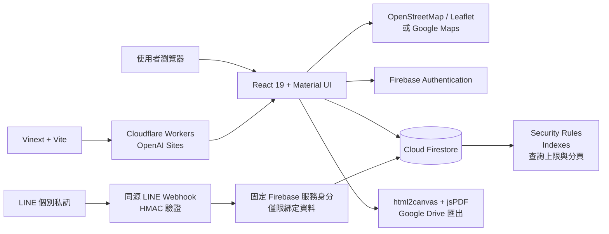
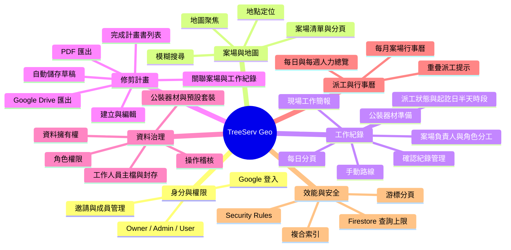

# TreeServ Geo 系統架構與技術說明

本文件記錄 TreeServ Geo 目前使用的系統結構、技術棧、開發環境與主要技術決策。技術棧或架構變更時，應在同一個變更中同步更新本文件。

## 系統架構



## 功能心智圖



## 技術棧

| 領域           | 技術                                                          | 用途                                               |
| -------------- | ------------------------------------------------------------- | -------------------------------------------------- |
| 前端框架       | React 19、React DOM、TypeScript 5.9                           | 元件化介面與型別安全                               |
| 應用框架與建置 | Vinext、Vite 8                                                | 路由、React Server Components、SSR、開發與正式建置 |
| UI 與樣式      | Material UI 9、Emotion、Tailwind CSS 4、PostCSS、Lucide React | 設計系統、響應式版面與圖示                         |
| 身分驗證       | Firebase Authentication、Google Sign-In                       | 登入、帳號切換與工作階段持久化                     |
| 資料庫         | Cloud Firestore                                               | 案場、工作紀錄、人員／器材主檔、邀請、成員、計畫、草稿與稽核資料 |
| 地圖           | OpenStreetMap、Leaflet 1.9、Google Maps JavaScript API Loader | 案場顯示、搜尋、定位與地圖互動                     |
| 文件輸出       | html2canvas、jsPDF、Google Drive API                          | 修剪計畫圖像化、PDF 與雲端硬碟匯出                 |
| 部署           | Cloudflare Workers、Wrangler、OpenAI Sites                    | 邊緣執行、本機模擬與正式站台託管                   |

目前 OpenAI Sites 專案未配置 D1 或 R2，主要雲端資料服務為 Firebase。

## LINE 個別帳號綁定

- 測試官方帳號為 `@604msveq`，Messaging API Channel ID 為 `2011607818`。
- `POST /api/line/webhook` 使用後端 `LINE_CHANNEL_SECRET` 對原始請求位元組驗證 HMAC-SHA256 簽章，通過後才解析事件；請求大小限制 256 KiB。
- 管理員在工作夥伴清單產生一次性綁定碼（128-bit 隨機值）。只保存 SHA-256 摘要於 `lineBindingRequests/{personnelId}`；30 分鐘後失效，每位人員只有一組有效碼。Security Rules 限制只有 Owner／Admin 可為使用中的人員產生碼，取消／重發後舊碼不能使用。
- 夥伴加 Bot 好友後，在個別聊天室傳送「綁定 人員ID.隨機碼」。群組指令完全忽略，不在群組公開綁定資訊。後端檢查來源、個人資料可讀、碼的有效期、封存狀態及一對一對應，透過 Firestore REST transaction 原子消耗綁定碼、保存雙向對應、更新公開狀態與稽核。
- `lineBindings/{personnelId}` 保存 LINE userId；`lineAccounts/{lineUserId}` 保存反向對應及最後事件時間。只有 LINE 專用服務可讀寫，包含管理員在內的前端不能讀取 LINE userId。`personnel.lineStatus` 為 `bound`／`blocked`／`unbound`，`lineUpdatedAt` 使用伺服器時間；兩者禁止前端偽造，既有無欄位人員視為未綁定。
- follow／unfollow 更新封鎖狀態；比較事件時間並使用事件 ID 防止重送及較舊事件覆寫新狀態。本人私訊「解除綁定」可清除雙向對應與待用綁定碼；`lineBindingAudit` 僅新增不可改写，記錄人員 ID、動作、管理者（綁定時）與伺服器時間，不保存 LINE userId。
- 工作夥伴清單、工作紀錄選人及派工總覽顯示綁定狀態。未綁定不阻擋排班；已綁定不表示工作已接受或訊息保證送達，封存人員不可接收新派工。
- 後端交易沿用 Firebase 用戶端的樂觀鎖定：`batchGet` 取得文件版本，`commit` 以 `updateTime`／`exists: false` 前置條件一次提交；唯讀文件加入 verify。遇到並行封存、重發碼或重複綁定時全部拒絕，不部分寫入。固定受限身分不使用正式環境拒絕的 `beginTransaction` 方式。
- 後端使用 `LINE_FIREBASE_REFRESH_TOKEN` 取得固定 UID `treeserv-line-bot`、`lineService: true`、`custom` provider 的 Firebase ID token，再存取 REST API，仍受 Security Rules 限制，不使用繞過規則的 Google OAuth 資料庫管理權限。服務可讀取單筆人員、工作紀錄與案場（不可列舉或修改案場／工作紀錄），更新 LINE 狀態及存取綁定、派工邀請集合；不能存取成員資料。
- 初始化身分由專用服務帳戶完成，不授予其專案 IAM 角色；一次性初始化金鑰在記憶體中使用後立即撤銷，不放本機檔案或正式站。正式站只保存受限工作階段的 refresh token；若要撤銷服務，可停用 Firebase Authentication 中的 `treeserv-line-bot` 身分並更新／移除 Sites secret。不得將本機開發紀錄 MCP 的服務帳戶用於 LINE。
- LINE 後台 Verify 空事件與「串接測試」仍可使用。綁定及工作回覆只使用 Reply API，保存成功但一次性 Reply 失敗時不重做資料、不改用 Push。
- 管理員在已儲存工作紀錄的「LINE 個別派工邀請」逐位確認發送。`POST /api/line/dispatch` 以 Firebase accounts:lookup 驗證呼叫者；非 Owner 再用呼叫者自己的 ID token 讀取成員文件確認 active/admin。前端不能指定收件 LINE userId、訊息或期限。後端重新讀取人員、綁定與指派資料，拒絕過去日期、已完成／取消工作及未綁定／封存人員。僅支援私訊，不對群組派工，儲存紀錄不自動發送。
- 儲存工作紀錄時若連結的是舊示範／匯入案場且尚無 `locations/{locationId}` 文件，會先以該案場的既有名稱、地址與座標補建相同穩定 ID 的案場文件，再保存工作紀錄；因此舊資料不會因畫面可見但後端無案場文件而無法派工。
- `dispatchInvitations/{SHA256(recordId+分隔符+personnelId)}` 保存每位夥伴在該工作紀錄的最新摘要。只有 Owner／Admin 能讀取，後端才能寫入，禁止含 LINE userId。画面以單一 `where(recordId == ...)` 加 `limit(100)` 訂閱，無新增複合索引。`dispatchAttempts/{UUID}` 僅後端單筆存取，保存實際收件者、不可變訊息、發送者、取消者及回覆稽核，前端不可讀取。
- 每份邀請自伺服器開始發送起 **8 小時**有效。伺服器在每次按鈕回覆用當下時間驗證期限，`now >= expiresAt` 即拒絕，不使用 LINE 事件原始時間延長期限。畫面自行計算「已失效」，不需要寫回資料庫；已接受／已拒絕為終態，不隨期限變成失效。沒有 Cloud Scheduler、分鐘輪詢、計費啟用、逾時主動 LINE 管理者通知或自動補人。畫面 timer 只更新本機顯示，不查詢後端。
- Push API 固定使用每次邀請 UUID 作為 `X-Line-Retry-Key`。斷線／5xx 或中途停止保留 sending/uncertain，不宣稱成功；管理者至少隔 30 秒手動確認時，重用同一份收件者／訊息／key，不延長有效期。LINE 200 或附已受理 ID 的 409 轉 pending，明確 4xx 為 failed；已受理不等於保證送達。沒有自動重試或重複 Push。
- 已簽章的個別 postback 必須符合私密邀請的收件者、目前綁定、最新邀請及工作配置。日期、角色、工作內容、集合或安全資訊改變、人員移除／封存、工作取消及邀請取消後，舊按鈕無效。重複回覆不能翻轉接受／拒絕；後續傳送完成也不能覆寫已回覆狀態。管理員可取消後重邀，取消不另外傳 LINE；未綁定人員仍可排班並另行聯絡。
- 邀請測試 `tests/line-dispatch.test.mjs` 涵蓋固定期限、邊界、變更／取消、收件者驗證、重試去重及管理者權限；`tests/line-store.test.mjs` 驗證 Emulator 的真實 REST 巢狀資料解碼及邀請／回覆原子寫入。測試不寄送真實 LINE。
- 憑證僅放後端秘密設定，不使用 `VITE_` 前綴、不傳到瀏覽器、不寫入日誌。已忽略的 `.env.line.local` 供本機填寫；不會自動被 Vite 載入或同步到正式站。
- 本機可使用 Node 22.13+ 執行 `node scripts/check-line-connection.mjs`，只讀取 LINE Bot 資料並核對公開 basic ID，不發送訊息。Channel secret 的正確性仍需由 LINE Webhook Verify 驗證。
- 設定憑證、發布接收端後，再於 LINE Developers 填入實際 Webhook URL、Verify 並開啟 Use webhook。網址未發布前不可視為已串接。
- 接收端測試：`node --experimental-strip-types --test tests/line-webhook.test.mjs`；測試使用虛擬資料與替代發送函式，不存取 LINE 或正式資料庫。
- 綁定邏輯：`node --experimental-strip-types --test tests/line-bindings.test.mjs`；本機 Emulator 啟動後另執行 `node --experimental-strip-types --test tests/line-store.test.mjs` 及 `npm run test:rules`，涵蓋真實 REST 交易、封鎖／解除與權限拒絕案例。macOS Emulator 若因中文語系失敗，以 `-Duser.language=en -Duser.country=US` 啟動 Java。
- 外部規格：[Firebase REST 身分與規則](https://firebase.google.com/docs/firestore/use-rest-api)、[交易讀取](https://firebase.google.com/docs/firestore/reference/rest/v1/projects.databases.documents/batchGet)、[LINE Webhook](https://developers.line.biz/en/docs/messaging-api/receiving-messages/)。

## 開發環境

- Node.js 22.13 以上與 npm
- Vinext 開發伺服器
- Wrangler 與 Miniflare 本機 Workers 環境
- Firestore Emulator：`127.0.0.1:8088`
- Node.js 原生測試執行器與 Firebase Rules Unit Testing
- Oxlint、TypeScript 與 Oxfmt
- GitHub Actions 在 Pull Request 與 `main` push 執行型別檢查、lint、MCP 測試及正式建置
- macOS 受限執行環境使用 polling 進行檔案監看

常用指令：

```bash
npm run dev
npm run typecheck
npm run build
npm run lint
npm run test:rules
npm run format
```

第一階段 CI 位於 `.github/workflows/ci.yml`，只驗證、不部署。型別檢查、lint、MCP 測試與正式建置都是強制關卡；任一項失敗都會阻擋 CI。Firestore Rules 測試仍需由 `127.0.0.1:8088` 的 Emulator 執行，尚未納入此 workflow。

## 驗證與權限流程

1. 使用者透過 Google 帳號登入 Firebase Authentication。
2. 系統先辨識專案擁有者，再查詢 `members` 與 `accessInvites` 判定 Admin 或 User 權限。非 Owner 帳號會即時監聽自己的成員資料；角色變更時立即更新可用功能，帳號停用時自動登出。只有 Owner 能在兩者之間調整成員角色；Admin 僅能啟用或停用一般使用者，不能調整角色、自己或其他 Admin。`members` 文件不允許實體刪除，撤銷存取權一律透過可稽核的停用流程。
3. 正式站台透過同源 `/__/auth/*` 代理完成 Firebase Popup 驗證，降低第三方儲存限制造成的登入失敗。
4. Firestore Security Rules 同時檢查登入狀態、角色、資料擁有者與允許修改的欄位。
5. 重要管理操作寫入 `activityLogs`，保留操作者、動作、紀錄與時間資訊。
6. `personnel` 與 `equipmentCatalog` 允許所有有效成員讀取，但只有 Owner／Admin 可新增、修改或封存；兩者不提供實體刪除，以保護舊工作紀錄引用。
7. 權限管理畫面中的角色變更先保留為本機待確認選項，經 Owner 確認後才連同操作紀錄寫入；完整角色範圍說明只向 Owner 顯示。

## 派工、人員與器材資料流

- 工作人員以 `personnel` 文件 ID 作為不變識別碼；姓名、辨識編號、職務、技能、可擔任角色及 `active`／`archived` 狀態存於主檔。
- 工作紀錄以 `siteLead` 與 `crewAssignments` 保存人員 ID、工作角色及建立當下的姓名快照。畫面優先顯示現行主檔名稱；主檔無法取得時仍以快照顯示，因此舊紀錄不會失去人名。
- 舊資料的 `crew: string[]` 保持可讀、可移除但不可再新增；新資料改用 ID 引用，避免同名與改名造成誤認。
- 公裝以 `equipmentCatalog` 管理預設數量、單位及適用套裝；工作紀錄的 `equipmentItems` 是可現場修改的快照，不會因主檔後續調整而改變已確認需求。
- 工作紀錄排程狀態為待排程、已排程、進行中、已完成或取消。派工總覽只查詢已排程與進行中（單次最多 100 筆），依日期、全天／上午／下午及人員 ID 判斷重疊；衝突只提示、不阻擋儲存。
- 新工作紀錄以 `startDaySlot` 與 `endDaySlot` 分別記錄起始日、結束日的全天／上午／下午；舊 `scheduleSlot` 與 `estimatedDays` 僅保留向後相容，不再提供預估工時輸入。
- 天氣欄位由案場座標與施工起始日透過 Open-Meteo 自動查詢，表單只讀；集合時間限制為 05:00–20:00 的 15 分鐘選項。
- 修剪計畫沿用 `drafts` 儲存內容，並在資料內保存 `locationId`、選填的 `workRecordId`、完成時間與 Drive PDF 連結，供計畫書列表與案場按鈕使用。

## 資料讀取與效能策略

- Firestore `list` 請求受安全規則限制，單次最多讀取 100 筆。
- 案場清單每頁載入 50 筆，透過 `startAfter` 游標取得下一頁。
- 工作紀錄只查詢目前案場，每次載入 20 筆並支援載入更多。
- 邀請、成員與草稿查詢均使用明確的筆數上限。
- 查詢條件與排序所需欄位由 Firestore 複合索引配合。

## 維護原則

- 新增或移除主要套件、雲端服務、地圖提供者或部署平台時，更新「技術棧」。
- 修改資料流、權限模型或外部服務關係時，更新「系統架構」。
- 新增主要產品領域時，更新「功能心智圖」。
- 調整 Node.js、模擬器、測試或格式化工具時，更新「開發環境」。
