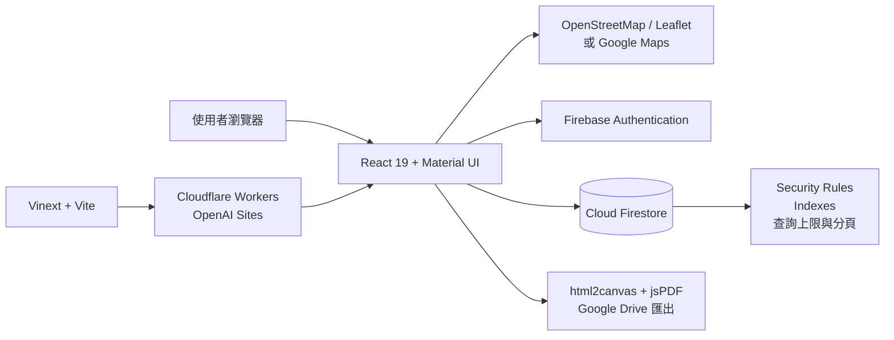
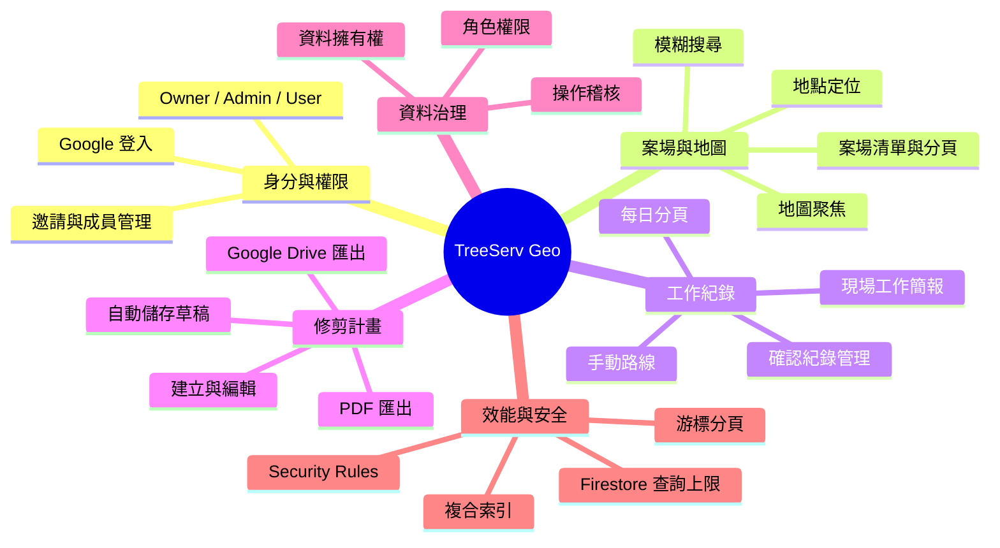

# TreeServ Geo 系統架構與技術說明

本文件記錄 TreeServ Geo 目前使用的系統結構、技術棧、開發環境與主要技術決策。技術棧或架構變更時，應在同一個變更中同步更新本文件。

## 系統架構



## 功能心智圖



## 技術棧

| 領域           | 技術                                                          | 用途                                               |
| -------------- | ------------------------------------------------------------- | -------------------------------------------------- |
| 前端框架       | React 19、React DOM、TypeScript 5.9                           | 元件化介面與型別安全                               |
| 應用框架與建置 | Vinext、Vite 8                                                | 路由、React Server Components、SSR、開發與正式建置 |
| UI 與樣式      | Material UI 9、Emotion、Tailwind CSS 4、PostCSS、Lucide React | 設計系統、響應式版面與圖示                         |
| 身分驗證       | Firebase Authentication、Google Sign-In                       | 登入、帳號切換與工作階段持久化                     |
| 資料庫         | Cloud Firestore                                               | 案場、工作紀錄、邀請、成員、計畫、草稿與稽核資料   |
| 地圖           | OpenStreetMap、Leaflet 1.9、Google Maps JavaScript API Loader | 案場顯示、搜尋、定位與地圖互動                     |
| 文件輸出       | html2canvas、jsPDF、Google Drive API                          | 修剪計畫圖像化、PDF 與雲端硬碟匯出                 |
| 部署           | Cloudflare Workers、Wrangler、OpenAI Sites                    | 邊緣執行、本機模擬與正式站台託管                   |

目前 OpenAI Sites 專案未配置 D1 或 R2，主要雲端資料服務為 Firebase。

## 開發環境

- Node.js 22.13 以上與 npm
- Vinext 開發伺服器
- Wrangler 與 Miniflare 本機 Workers 環境
- Firestore Emulator：`127.0.0.1:8088`
- Node.js 原生測試執行器與 Firebase Rules Unit Testing
- Oxlint、TypeScript 與 Oxfmt
- macOS 受限執行環境使用 polling 進行檔案監看

常用指令：

```bash
npm run dev
npm run build
npm run lint
npm run test:rules
npm run format
```

## 驗證與權限流程

1. 使用者透過 Google 帳號登入 Firebase Authentication。
2. 系統先辨識專案擁有者，再查詢 `members` 與 `accessInvites` 判定 Admin 或 User 權限。
3. 正式站台透過同源 `/__/auth/*` 代理完成 Firebase Popup 驗證，降低第三方儲存限制造成的登入失敗。
4. Firestore Security Rules 同時檢查登入狀態、角色、資料擁有者與允許修改的欄位。
5. 重要管理操作寫入 `activityLogs`，保留操作者、動作、紀錄與時間資訊。

## 資料讀取與效能策略

- Firestore `list` 請求受安全規則限制，單次最多讀取 100 筆。
- 案場清單每頁載入 50 筆，透過 `startAfter` 游標取得下一頁。
- 工作紀錄只查詢目前案場，每次載入 20 筆並支援載入更多。
- 邀請、成員與草稿查詢均使用明確的筆數上限。
- 查詢條件與排序所需欄位由 Firestore 複合索引配合。

## 維護原則

- 新增或移除主要套件、雲端服務、地圖提供者或部署平台時，更新「技術棧」。
- 修改資料流、權限模型或外部服務關係時，更新「系統架構」。
- 新增主要產品領域時，更新「功能心智圖」。
- 調整 Node.js、模擬器、測試或格式化工具時，更新「開發環境」。
